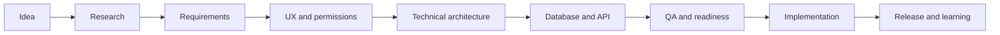
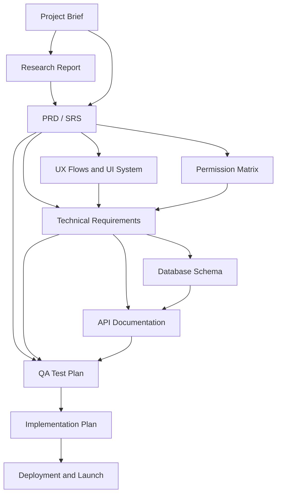
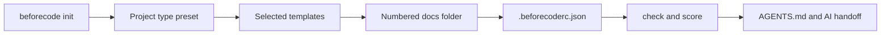

<div align="center">


# BeforeCode

**Plan first. Build with confidence.**

A spec-first software planning toolkit and CLI for humans and AI coding agents.

[](LICENSE)
[](package.json)
[](.github/workflows/docs-quality.yml)
[](.github/workflows/cli-test.yml)

[Install](#install-beforecode) · [How it works](#how-beforecode-works) · [Project types](#choose-a-project-type) · [Examples](#complete-reference-packs) · [Contribute](CONTRIBUTING.md)

</div>

---

BeforeCode turns an idea into a connected, build-ready source of truth before implementation starts. It combines product requirements, UX, architecture, database and API planning, permissions, QA, deployment, and AI coding handoff in portable Markdown documents.

## Why BeforeCode

Projects usually become expensive because requirements are incomplete, decisions conflict, edge cases arrive late, and developers or AI coding agents are forced to guess.

BeforeCode helps answer five questions before code becomes the answer:

1. What are we building, for whom, and why?
2. What belongs in this release—and what does not?
3. How should the experience, architecture, data, API, and permissions work?
4. How will failures, risks, and edge cases be handled?
5. What evidence proves the project is ready to build and release?

## Install BeforeCode

Requires Node.js 18 or later.

Until the package is published to npm, install the current stable CLI directly from `main` inside your project:

```bash
npm install --save-dev github:BAKUGOS1/beforecode#main
```

Generate a documentation set:

```bash
npx beforecode init --type saas --name "My SaaS"
```

Verify and prepare the project:

```bash
npx beforecode check
npx beforecode score
npx beforecode handoff --name "My SaaS"
```

> The CLI preserves existing files by default. Use `--dry-run` to preview changes and `--force` only when replacement is intentional.

See the complete [CLI usage guide](docs/cli-usage.md).

## How BeforeCode Works

The workflow moves from evidence and decisions to implementation and release. Each stage reduces ambiguity for the next stage.



The documents are connected rather than independent templates:



The CLI converts the selected project type into a safe local documentation workspace:



## Choose a Project Type

| Type | Best for | Command |
|---|---|---|
| `small` | Prototype or small internal tool | `npx beforecode init --type small` |
| `portfolio` | Portfolio or personal website | `npx beforecode init --type portfolio` |
| `saas` | Multi-user SaaS product | `npx beforecode init --type saas` |
| `crm` | CRM, ERP, or operations system | `npx beforecode init --type crm` |
| `ecommerce` | Store or marketplace | `npx beforecode init --type ecommerce` |
| `mobile` | Mobile application | `npx beforecode init --type mobile` |
| `ai-agent` | Tool-using or autonomous agent | `npx beforecode init --type ai-agent` |
| `opensource` | Public library, CLI, or tool | `npx beforecode init --type opensource` |

Read the [project type guide](docs/project-types.md) for the reasoning behind each document set.

## Step-by-Step Usage

### Step 1 — Install in the Target Project

```bash
cd your-project
npm install --save-dev github:BAKUGOS1/beforecode#main
```

### Step 2 — Preview the Generated Files

```bash
npx beforecode init --type saas --name "Your Project" --dry-run
```

### Step 3 — Generate the Documentation Set

```bash
npx beforecode init --type saas --name "Your Project"
```

Typical output:

```text
your-project/
├── .beforecoderc.json
└── docs/
    ├── 01-project-brief.md
    ├── 02-research-report.md
    ├── 03-prd.md
    ├── 04-trd.md
    ├── 05-database-schema.md
    ├── 06-api-documentation.md
    ├── 07-qa-test-plan.md
    └── 08-implementation-plan.md
```

The exact files depend on the selected project type.

### Step 4 — Complete Documents in Decision Order

Start with the problem and user. Approve scope before architecture. Keep roles, statuses, fields, requirements, and terminology consistent across every file.

Use stable IDs such as:

```text
BR-001  Business requirement
FR-001  Functional requirement
NFR-001 Non-functional requirement
TC-001  Test case
```

### Step 5 — Check Readiness

```bash
npx beforecode check
npx beforecode score
```

`check` reports missing recommended documents. `score` summarizes document presence by product, experience, engineering, quality, and delivery categories.

The current MVP score measures file coverage, not the quality of the written content. Use the [readiness checklists](checklists/README.md) for human review.

### Step 6 — Prepare AI Coding Handoff

```bash
npx beforecode handoff --name "Your Project"
```

This creates:

```text
AGENTS.md
docs/ai-handoff.md
```

These files instruct an AI coding agent to read approved documents, stay inside scope, request approval for high-impact actions, run checks, and report evidence.

### Step 7 — Build, Verify, and Update the Source of Truth

Use the implementation plan phase by phase. When an approved requirement or architecture decision changes, update the earliest affected source document and review downstream UX, technical, API, database, QA, and deployment documents.

## What Is Included

| Area | Included assets |
|---|---|
| Product | Project brief, research, BRD, PRD, SRS, release scope |
| Experience | UX flows, UI system, roles and permission matrix |
| Engineering | TRD, database schema, API documentation, decision records |
| Delivery | Implementation plan, build plan, deployment plan |
| Quality | PRD, technical, API, QA, pre-build, and launch checklists |
| AI handoff | Documentation review, build, audit, and test prompts |
| CLI | Generate, add, list, check, score, and handoff commands |
| Examples | Complete SaaS CRM and AI agent reference packs |

- [Browse templates](templates/README.md)
- [Open readiness checklists](checklists/README.md)
- [Use the AI prompt library](prompts/README.md)
- [Read all repository guides](docs/folder-index.md)

## Complete Reference Packs

### MiniCRM — SaaS CRM

A complete multi-tenant CRM specification covering product requirements, architecture, PostgreSQL schema, API contracts, permissions, QA, and phased delivery.

[Explore MiniCRM →](examples/saas-crm/README.md)

### TaskPilot — AI Agent

A researched agent architecture covering durable execution, checkpoints, approval gates, tool security, memory, evaluation, observability, threat modeling, and implementation.

[Explore TaskPilot →](examples/ai-agent/README.md)

## Repository Structure

```text
beforecode/
├── bin/           CLI executable
├── src/           CLI commands, generator, scoring, and project presets
├── tests/         Node.js test suite
├── docs/          Usage guides, CLI design, and roadmap
├── templates/     Reusable planning documents
├── checklists/    Quality and readiness gates
├── prompts/       AI-assisted documentation and build prompts
├── examples/      Complete reference documentation packs
├── assets/        Repository visual assets
└── .github/       Issue forms and quality automation
```

## Safety and Quality

- Existing project files are not overwritten unless `--force` is supplied.
- `--dry-run` previews generation without writing files.
- Documentation Markdown is checked through GitHub Actions.
- CLI behavior is covered by Node.js tests and command smoke tests.
- Generated content is a starting structure; product, security, legal, and architecture decisions remain human-owned.

## README and Documentation Ownership

The maintainer owns the root README and updates it whenever installation, CLI commands, supported project types, repository structure, release status, or the main workflow changes.

Every contributor must update affected documentation in the same change. A feature is not complete if its usage, verification, or limitations are missing from the README or relevant guide.

The project uses a lightweight direct-to-`main` maintainer workflow. Small changes remain focused, are verified by the relevant GitHub Actions checks, and keep `main` usable.

## Project Status

The template library, CLI MVP, and two complete example packs are ready for use. The npm package has not been published yet, so installation currently uses the GitHub `main` branch.

Next priorities include guided setup, stronger quality scoring, more reference packs, traceability checks, npm publishing, and a documentation website.

- [Main roadmap](docs/roadmap.md)
- [CLI roadmap](docs/cli-roadmap.md)
- [Changelog](CHANGELOG.md)

## Contributing

Contributions are welcome, especially stronger templates, realistic example packs, CLI improvements, clearer acceptance criteria, and better review checks.

Read [CONTRIBUTING.md](CONTRIBUTING.md), follow the [Code of Conduct](CODE_OF_CONDUCT.md), and use the issue templates for proposals and reports.

## Security

Do not report sensitive security concerns through public issues. Follow [SECURITY.md](SECURITY.md).

## License

Released under the [MIT License](LICENSE).

<div align="center">

If BeforeCode helps your project, star the repository and share the workflow.

</div>
