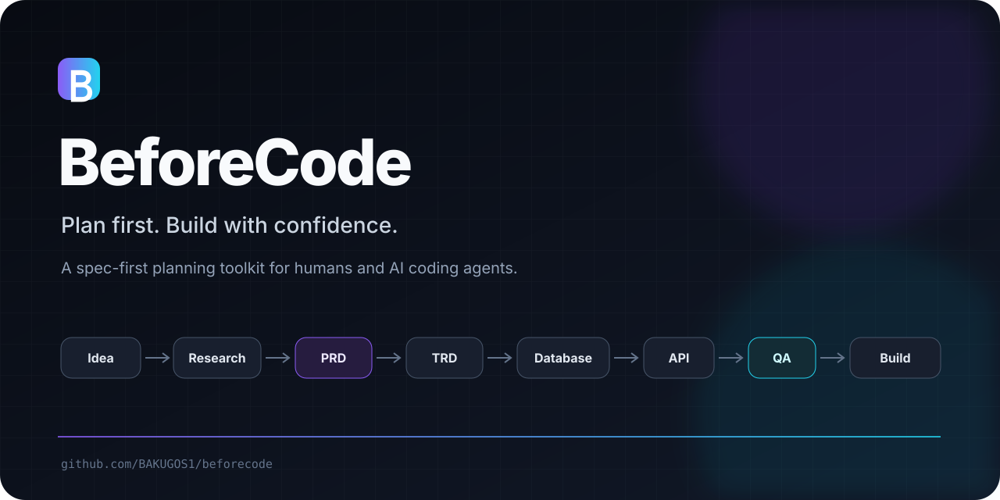

<div align="center">



# BeforeCode

**Plan first. Build with confidence.**

**A spec-first software planning toolkit for humans and AI coding agents.**

[](LICENSE)
[](https://www.markdownguide.org/)
[](CONTRIBUTING.md)
[](docs/getting-started.md)

[Get started](docs/getting-started.md) · [Browse templates](templates/README.md) · [See examples](examples/README.md) · [Use AI prompts](prompts/README.md) · [Roadmap](docs/roadmap.md)

</div>

---

BeforeCode helps you turn an idea into a build-ready source of truth before implementation begins. It combines product requirements, technical architecture, database and API planning, permissions, UX, QA, deployment, and AI handoff in one practical Markdown workflow.

```text
Idea → Research → Requirements → Architecture → Data → API → QA → Implementation
```

## Why BeforeCode?

Projects rarely become difficult because typing code is slow. They become difficult because requirements are incomplete, decisions conflict, edge cases appear late, and AI coding tools receive weak context.

BeforeCode gives teams a repeatable way to answer:

- What are we building, for whom, and why?
- What belongs in the MVP—and what does not?
- How should the system, database, API, permissions, and UX work?
- What must be tested before release?
- What context should a developer or AI coding agent receive?

## What you get

| Area | Included |
|---|---|
| Product | Project brief, research, BRD, PRD, SRS, release scope |
| Experience | UX flows, UI system, roles and permission matrix |
| Engineering | TRD, database schema, API docs, decision records |
| Delivery | Implementation plan, build plan, deployment plan |
| Quality | PRD, technical, API, QA, pre-build, and launch checklists |
| AI handoff | Prompts for generating, reviewing, building, and testing from docs |
| Examples | Complete SaaS CRM and production-oriented AI agent packs |

## Quick start

### 1. Choose a documentation track

| Project | Recommended starting set |
|---|---|
| Small app | Project Brief → PRD → Build Plan → QA |
| SaaS | Research → PRD → TRD → Database → API → QA → Deployment |
| CRM/ERP | BRD → PRD → SRS → Permissions → Data → API → QA |
| AI agent | PRD → TRD → Workflow → Tools → Memory → Evals → Threat Model |
| Open source | Brief → Roadmap → README → Contributing → Release Checklist |

See the complete [project type guide](docs/project-types.md).

### 2. Copy the templates

```bash
git clone https://github.com/BAKUGOS1/beforecode.git
cp -R beforecode/templates ./project-docs
```

Or copy only the files your project needs from the [template catalog](templates/README.md).

### 3. Complete the documents in order

Start with facts and decisions. Write measurable acceptance criteria. Link related requirements across product, technical, data, API, and QA documents.

### 4. Review readiness

Use the [checklists](checklists/README.md) before implementation and release.

### 5. Hand off to development or an AI agent

Use the [AI coding handoff guide](docs/ai-coding-handoff.md) and [prompt library](prompts/README.md). Keep approved documents as the source of truth.

## Complete examples

### MiniCRM — SaaS CRM

A complete multi-tenant CRM pack covering product requirements, architecture, PostgreSQL schema, API contracts, permissions, QA, and phased delivery.

[Open MiniCRM pack →](examples/saas-crm/README.md)

### TaskPilot — AI Agent

A researched agent architecture covering durable execution, checkpoints, approval gates, tool security, memory, evaluation, observability, threat modeling, and implementation.

[Open TaskPilot pack →](examples/ai-agent/README.md)

## Repository map

```text
beforecode/
├── docs/          Usage guides and project workflow
├── templates/     Reusable planning documents
├── checklists/    Quality and readiness gates
├── prompts/       AI-assisted documentation and build prompts
├── examples/      Complete reference documentation packs
└── .github/       Contribution and issue workflows
```

## Design principles

- **Practical over ceremonial** — every document should support a real decision.
- **Specific over vague** — requirements need owners, rules, limits, and acceptance criteria.
- **Traceable by default** — product, technical, API, database, and QA decisions should agree.
- **AI-friendly, human-owned** — AI can accelerate documentation; people approve scope and risk.
- **Progressive depth** — small projects use a few files; complex systems use the full pack.
- **Markdown-first** — portable, reviewable, version-controlled, and tool-independent.

## Project status

BeforeCode is actively evolving. The core template library and two complete example packs are ready for use. Upcoming work includes more example packs, documentation automation, and a generator experience.

See the [roadmap](docs/roadmap.md) and [changelog](CHANGELOG.md).

## Contributing

Contributions are welcome—especially stronger templates, real example packs, clearer acceptance criteria, and better review checklists.

Read [CONTRIBUTING.md](CONTRIBUTING.md), follow the [Code of Conduct](CODE_OF_CONDUCT.md), and use the issue templates before opening a pull request.

## Security

Please do not report security concerns through public issues. Follow [SECURITY.md](SECURITY.md).

## License

Released under the [MIT License](LICENSE).

<div align="center">

If BeforeCode helps your project, consider starring the repository and sharing the workflow.

</div>
