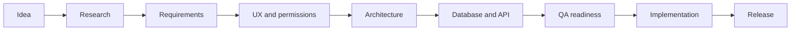
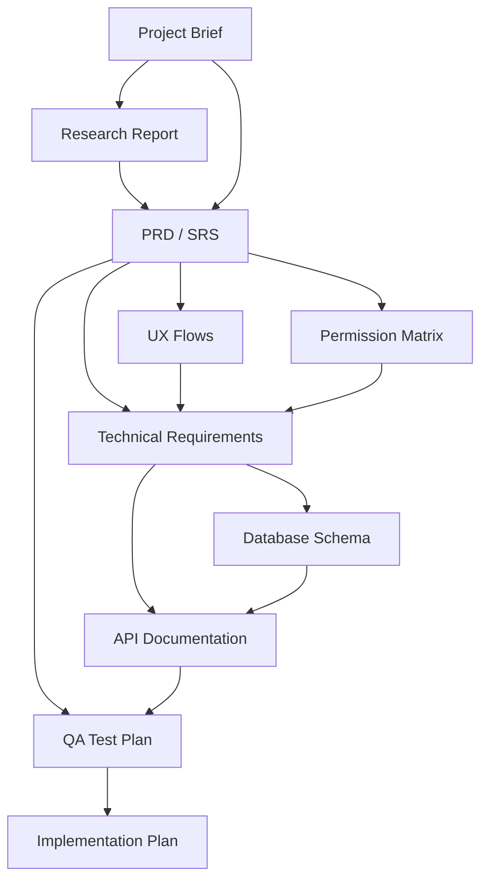

<div align="center">

# BeforeCode

**Plan first. Build with confidence.**

Spec-first project planning toolkit and CLI for humans and AI coding agents.

[](https://www.npmjs.com/package/beforecode)
[](package.json)
[](LICENSE)

[Install](#install) · [Workflow](#workflow) · [Commands](#commands) · [Project types](#project-types) · [Examples](#examples) · [References](docs/references.md)

</div>

---

BeforeCode helps you turn an idea into a build-ready documentation system before implementation starts. It generates connected Markdown documents for product requirements, UX, architecture, database, API, QA, deployment, and AI coding handoff.

## Install

The easiest way to start is with `npx`. This runs the latest published package without adding it to your project first.

```bash
npx beforecode init --type saas --name "My App"
```

For teams and repeat usage, install BeforeCode as a development dependency so every contributor uses the same CLI version.

```bash
npm install --save-dev beforecode
npx beforecode --version
npx beforecode init --type saas --name "My App"
```

Global install is optional. Use it only when you want the `beforecode` command available everywhere on your machine.

```bash
npm install --global beforecode
beforecode --version
beforecode init --type saas --name "My App"
```

## Workflow



The documents are intentionally connected:



## Quick start

```bash
# Generate a full documentation set
npx beforecode init --type saas --name "My App"

# Check which docs are present
npx beforecode check

# Show readiness score by category
npx beforecode score

# Run a project health audit
npx beforecode doctor

# Generate AI coding agent handoff files
npx beforecode handoff --name "My App"
```

Generated structure:

```text
your-project/
├── .beforecoderc.json
└── docs/
    ├── 01-project-brief.md
    ├── 02-research-report.md
    ├── 03-prd.md
    ├── 04-trd.md
    ├── 05-database-schema.md
    ├── 06-api-documentation.md
    ├── 07-qa-test-plan.md
    └── 08-implementation-plan.md
```

## Commands

| Command | Description |
|---|---|
| `beforecode init --type <type>` | Generate a numbered documentation set |
| `beforecode add <template>` | Add a single template |
| `beforecode check` | Check which docs exist |
| `beforecode score` | Show readiness by category |
| `beforecode doctor` | Audit missing docs, weak docs, config, and AI handoff readiness |
| `beforecode handoff` | Generate `AGENTS.md` and AI handoff docs |
| `beforecode list` | Show project types and templates |

## Project types

| Type | Best for |
|---|---|
| `small` | Prototype or small app |
| `portfolio` | Portfolio or personal website |
| `saas` | Multi-user SaaS product |
| `crm` | CRM, ERP, or operations system |
| `ecommerce` | Store or marketplace |
| `mobile` | Mobile application |
| `ai-agent` | Tool-using or autonomous AI agent |
| `opensource` | Public library, CLI, or developer tool |

## What is included

- 17 document templates: PRD, TRD, SRS, database schema, API docs, QA plan, release scope, and more.
- Readiness checklists for product, API, technical, QA, launch, and pre-build review.
- AI prompts for documentation generation, audit, testing, and build handoff.
- Example packs for SaaS CRM and AI agent planning.
- Zero runtime dependencies.

## Safety defaults

- Existing files are not overwritten unless `--force` is passed.
- `--dry-run` previews generated files without writing.
- `.beforecoderc.json` saves project settings for future commands.
- Generated docs are starter structures; final product, security, legal, and architecture decisions remain human-owned.

## Examples and references

- [SaaS CRM example](examples/saas-crm/README.md)
- [AI agent example](examples/ai-agent/README.md)
- [CLI usage guide](docs/cli-usage.md)
- [Release runbook](docs/releasing.md)
- [Reference material](docs/references.md)

## Requirements

- Node.js 18 or later

## License

[MIT](LICENSE)

<div align="center">

If BeforeCode helps your project, star the repository and share the workflow.

</div>
