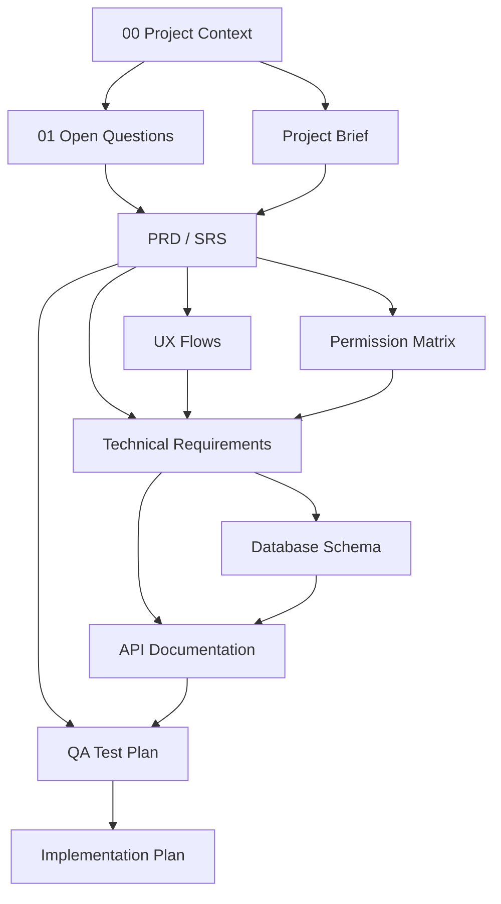

<div align="center">


<br />

[](https://www.npmjs.com/package/beforecode)
[](package.json)
[](LICENSE)
[](https://github.com/BAKUGOS1/beforecode/actions/workflows/cli-test.yml)

**Context-first project planning toolkit for humans and AI coding agents.**

[Install](#install) · [Context-first flow](#context-first-flow) · [Commands](#commands) · [Project types](#project-types) · [Examples](#examples-and-references)

</div>

---

## Why BeforeCode?

Most projects start coding too early. BeforeCode creates a planning workspace that captures the real idea first, asks for missing context, and then generates build-ready Markdown documentation.

| Without BeforeCode | With BeforeCode |
|---|---|
| Random template docs | Context-aware docs |
| AI agents guess missing details | Missing details become open questions |
| PRD, TRD, QA drift apart | Docs share one source of truth |
| Build starts before scope is clear | Build starts from reviewed context |

## Install

Recommended project setup:

```bash
npm install --save-dev beforecode
npx beforecode start
```

Use without installing:

```bash
npx beforecode start
```

Use a prepared idea file:

```bash
npx beforecode start --from idea.md
```

Advanced quick-template mode:

```bash
npx beforecode init --type saas --name "My App"
```

## Context-first flow


`beforecode start` captures your idea, target users, problem, MVP scope, out-of-scope items, technical preferences, and build mode before creating docs.



## Quick start

```bash
# Capture context and generate a planning workspace
npx beforecode start

# Check which docs are present
npx beforecode check

# Show readiness score by category
npx beforecode score

# Run a project health audit
npx beforecode doctor

# Generate AI coding handoff files
npx beforecode handoff --name "My App"
```

Generated structure:

```text
your-project/
├── .beforecoderc.json
└── docs/
    ├── 00-project-context.md
    ├── 01-open-questions.md
    ├── 03-project-brief.md
    ├── 04-research-report.md
    ├── 05-prd.md
    ├── 06-ux-flows.md
    ├── 07-trd.md
    └── ...
```

## What it generates

| Area | Output |
|---|---|
| Context | `00-project-context.md`, `.beforecoderc.json` |
| Discovery | `01-open-questions.md`, research report, business requirements |
| Product | PRD, SRS, release scope, UX flows, permission matrix |
| Engineering | TRD, database schema, API documentation, implementation plan |
| Quality | QA test plan, readiness scoring, doctor audit |
| AI handoff | `AGENTS.md`, `docs/ai-handoff.md` |

## Commands

| Command | Description |
|---|---|
| `beforecode start` | Capture project context first, then generate docs |
| `beforecode start --from idea.md` | Generate docs from an idea/context file |
| `beforecode init --type <type>` | Advanced quick-template mode |
| `beforecode add <template>` | Add a single template |
| `beforecode check` | Check which docs exist |
| `beforecode score` | Show readiness by category |
| `beforecode doctor` | Audit missing docs, shallow docs, config, and handoff readiness |
| `beforecode handoff` | Generate `AGENTS.md` and AI handoff docs |
| `beforecode list` | Show project types and templates |

## Project types

| Type | Best for |
|---|---|
| `small` | Prototype or small app |
| `portfolio` | Portfolio or personal website |
| `saas` | Multi-user SaaS product |
| `crm` | CRM, ERP, or operations system |
| `ecommerce` | Store or marketplace |
| `mobile` | Mobile application |
| `ai-agent` | Tool-using or autonomous AI agent |
| `opensource` | Public library, CLI, or developer tool |

## Safety defaults

- Existing files are not overwritten unless `--force` is passed.
- `--dry-run` previews generated files without writing.
- Missing context is written as `TBD` instead of being invented.
- `.beforecoderc.json` saves project settings for future commands.
- Generated docs are starter structures; final product, security, legal, and architecture decisions remain human-owned.

## Examples and references

- [SaaS CRM example](examples/saas-crm/README.md)
- [AI agent example](examples/ai-agent/README.md)
- [CLI usage guide](docs/cli-usage.md)
- [Release runbook](docs/releasing.md)
- [Reference material](docs/references.md)

## Requirements

- Node.js 18 or later

## License

[MIT](LICENSE)

<div align="center">

**BeforeCode helps teams start with clarity before opening the editor.**

</div>
